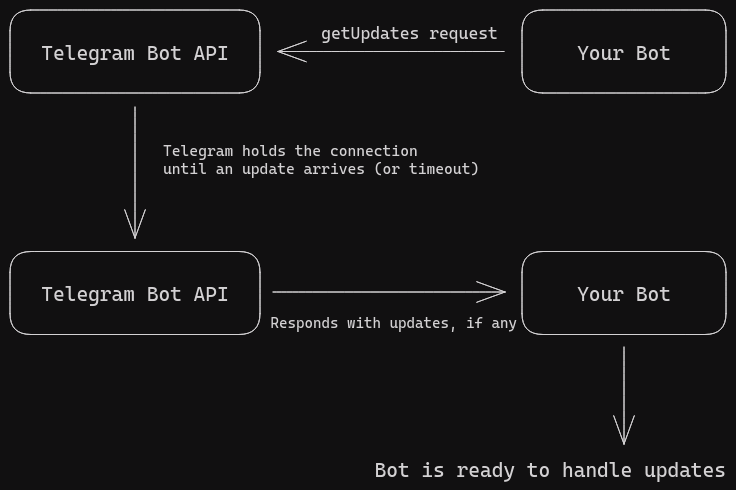
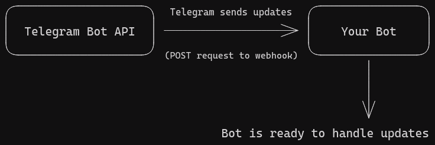

# Choosing the right update system

When creating a bot with TeleightBots, you can choose between two different approaches to receive updates from Telegram:
long-polling and webhooks. Each approach has its own advantages and disadvantages, and the best choice depends on your specific use case.

::: info
TL;DR: If you are new to bot development and/or you need a simple setup, use [long polling](./long-polling/getting-started). If you need better performance and scalability, use [webhooks](./webhooks/getting-started)
:::

## [Long Polling](./long-polling/getting-started) (Recommended for most use cases)
Long-polling is the simplest way to receive updates from Telegram. In this approach, your bot sends a request to the Telegram API and waits for a response. If there are no updates available, the request will hang until a new update is received or a timeout occurs.

It's very easy to set up and use, and is most suitable for small to medium-sized bots that don't require high performance or scalability.
However, long-polling has higher latency compared to webhooks and may not be suitable for high-traffic bots. In this case, webhooks are a better choice.

## [Webhooks](./webhooks/getting-started) (Advanced)
Webhooks are a more advanced way to receive updates from Telegram.
In this approach, Telegram sends updates to a URL that you specify, and your bot can process them in real-time.

Webhooks offer better performance and scalability compared to long-polling, as updates are delivered instantly without the need for constant polling to the Telegram API servers.
Instead, Telegram sends updates to your server as soon as they are available.

However, setting up webhooks requires more configuration and infrastructure, such as a server with a public IP address and SSL certificate.
You can use tools like ngrok for simple testing and development that allows you to securely expose your local server to the internet.

