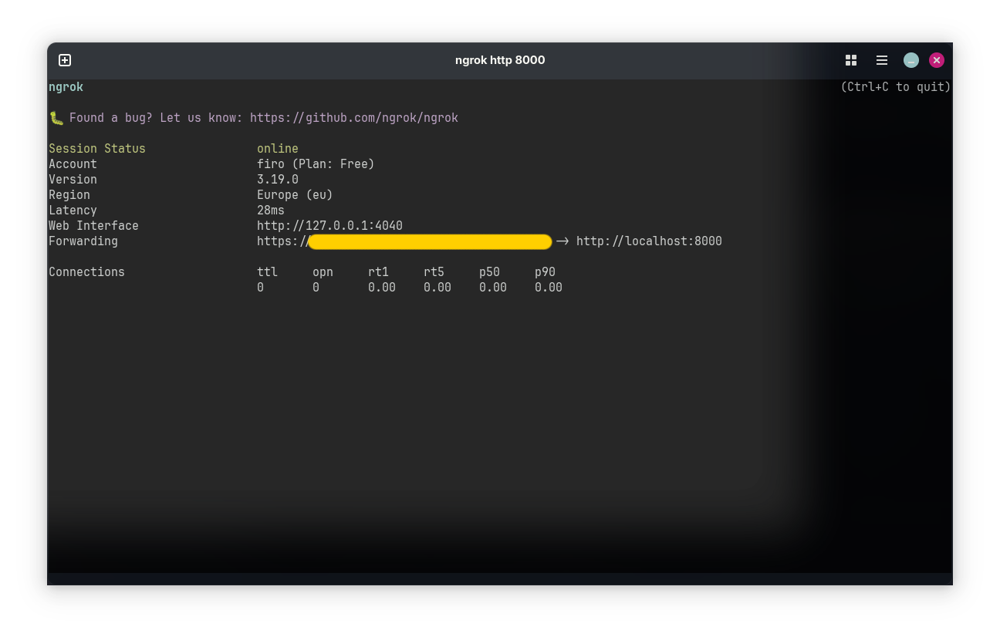
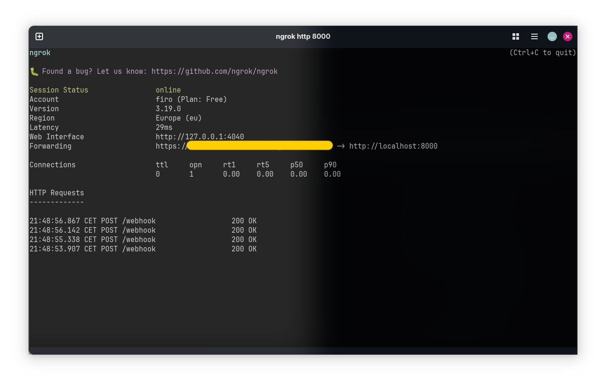

# Getting started with Webhooks
Webhooks are a more advanced way to receive updates from Telegram. In this approach, Telegram sends updates to a URL that you specify, and your bot can process them in real-time.

See the [Choosing the right update system](../choosing-update-system) page for more information.

::: warning
Setting up webhooks requires more configuration and infrastructure, such as a server with a public IP address and SSL certificate.
:::

::: tip
Telegram will only send request on port 443, 83, 8080, and 8443. Make sure your server is listening on one of these ports.
:::

## Overview
In order to create a bot using webhooks, you need to register the bot using the `registerWebhook` method of the `BotManager` class. There are two ways to set up webhooks:
 1. [Using the internal web server](#using-the-internal-web-server) (recommended for most use cases)
 2. [Creating a custom web server in your application](#creating-a-custom-web-server) (advanced)

In order to set a webhook either way, you must provide the configuration settings via the `WebhookBotSettings` record. This is just a wrapper to the [setWebhook](../api-examples.html#post-/setWebhook) method of the Telegram Bot API.

## Using the internal web server
TeleightBots provides an internal web server that you can use to receive updates from Telegram. This is the easiest way to set up webhooks, as you don't need to create a custom web server in your application.
It uses the Sun HttpServer API with a virtual thread pool to create a simple web server that listens for incoming requests on a specified port. It's not extremely performant, but it should be sufficient for virtually most use cases.

In order to set up an internal web server, you must provide a host, port, and (optional) SSL certificate settings. You can use the `WebhookServerConfig` record to configure the internal server settings.

```java
final String botToken = "your_bot_token_here"; // <-- The bot token from @BotFather
final String botUsername = "your_bot_username_here"; // <-- The bot username

final WebhookBotSettings webhookBotSettings = WebhookBotSettings.of("https://your-server-url", "/bot-path"); // Don't worry about trailing slashes. They will be handled automatically by Teleight
final WebhookServerConfig webhookServerConfig = WebhookServerConfig.ofBuilder()
        .host("localhost") // You can also avoid setting the host to use the default value (localhost)
        .port(8000)
        .build();

TeleightBots.getBotManager().registerWebhook(botToken, botUsername, webhookBotSettings, webhookServerConfig, bot -> {
    // Your code here
});
```

::: warning
The internal web server supports TLS 1.2 and 1.3.

The supported ciphers are:
- TLS_ECDHE_ECDSA_WITH_AES_256_GCM_SHA384
- TLS_ECDHE_RSA_WITH_AES_256_GCM_SHA384
- TLS_AES_256_GCM_SHA384

The supported key stores are: PKCS12 and JKS.

Any other configuration will not work.
:::


## Creating a custom web server
If you want to use a custom web server in your application, you can implement the `WebhookServer` interface and pass it to the `registerWebhook` method of the `BotManager` class.
You can see the [default Sun HttpServer implementation](https://github.com/Teleight/TeleightBots/blob/master/src/main/java/org/teleight/teleightbots/webhook/SunWebhookServerImpl.java) if you're looking for a reference.
```java
public class YourCustomWebServer implements WebhookServer {
    @Override
    public void start() throws Exception {
        // logic for starting the server
    }

    @Override
    public void addPostRoute(@NotNull String path, @NotNull Function<String, HttpResponse> response) throws Exception {
        // logic for adding a POST route
        // The response function takes the request body as an argument and returns a wrapped HttpResponse
    }

    @Override
    public void removePostRoute(@NotNull String path) throws Exception {
        // logic for removing a POST route
    }

    @Override
    public boolean isRunning() {
        // return whether the server is running or not
        return ...;
    }

    @Override
    public void close() throws IOException {
        // logic for closing the server
    }

}
```

Finally, you can register the bot with your custom web server like this:

```java
final WebhookBotSettings webhookBotSettings = WebhookBotSettings.of("https://your-server-url", "/bot-path");
final YourCustomWebServer server = new YourCustomWebServer(...params);
TeleightBots.getBotManager().registerWebhook(botToken, botUsername, webhookBotSettings, server, bot -> {
    // Your code here
});
```
Note that the `WebhookServerConfig` is not needed in this case, as you will be providing your own server implementation.

## Securing your webhook
In production environments, it's always better to at least secure your webhook a bit.
Fortunately, Telegram allows you to secure your webhook by providing a secret token in the `setWebhook` request.

```java
final var botSettings = WebhookBotSettings.ofBuilder("https://your-server-url", "/bot-path")
        .secretToken("your_super_secret_token_123")
        .build();
```

If you specify a secret token, the request will contain a header `X-Telegram-Bot-Api-Secret-Token` with the secret token specified before as content.
If you use a custom web server, you should check the header in the request to make sure that the request was sent by Telegram.

## Testing webhooks locally
You can use tools like ngrok for simple testing and development that allows you to securely expose your local server to the internet.

1. Download and install ngrok from [https://ngrok.com/download](https://ngrok.com/download)
2. Start a web server on your local machine with the port you specified in the webhook server config. In this example we're using port **8000**:
```bash
ngrok http 8000
```
You'll see something like this:


::: tip
There's no need to set up the SSL certificate in this case, as ngrok provides a secure tunnel to your local HTTP server.
:::

3. Copy the forwarding URL provided by ngrok and set it as the webhook URL in the WebhookBotSettings url
```java
final String botPath = "/webhook"; // This can be any path you want. For clearance, it's better if you match it with the bot username
final WebhookBotSettings webhookBotSettings = WebhookBotSettings.of("https://your-ngrok-url", botPath);
```
4. Start your bot. If you did everything correctly, you should see the following outputs in the ngrok console once your bot receives an update:

You can also use the [getWebhookInfo](../api-examples.html#get-/getWebhookInfo) method of the Telegram Bot API to check if the webhook is set up correctly.
